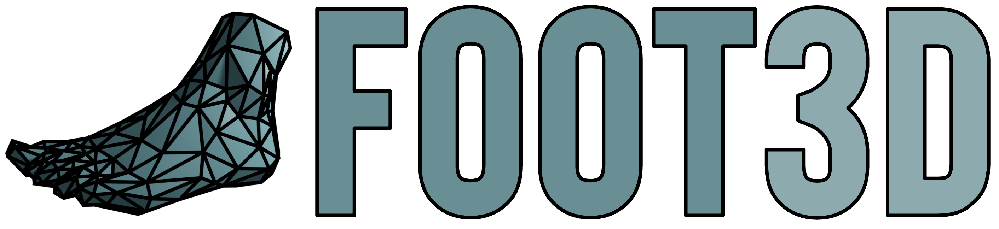

## Usage

High resolution foot scans for foot reconstruction tasks. We provide two datasets here:

- `Meshes`: 34 high resolution, scanned 3D foot models, as used in ['FIND: An Unsupervised Implicit 3D Model of Articulated Human Feet'](https://ollieboyne.github.io/FIND).
- `Multiview`: 474 calibrated images paired with 14 high resolution 3D foot scans for reconstruction evaluation, as used in [FOUND: Foot Optimisation with Uncertain Normals for Surface Deformation using Synthetic Data](http://ollieboyne.github.io/FOUND)

## Download instructions

To download the latest dataset, please fill in this [Google form](https://forms.gle/7eZh67UXMZYcM11M7), and you will be emailed a download link. Make sure to select the correct option out of `Meshes` and `Multiview` to receive the correct link.

See [meshes.md](meshes.md) and [multiview.md](multiview.md) for details on the dataset setups, as well as how to cite the datasets if you use them in your research.

## Acknowledgement

We acknowledge the collaboration and financial support of [Trya Srl](https://snapfeet.io).

If you make use of our Foot3D dataset, please cite our work:

For `Meshes`:

```
@inproceedings{boyne2022find,
            title={FIND: An Unsupervised Implicit 3D Model of Articulated Human Feet},
            author={Boyne, Oliver and Charles, James and Cipolla, Roberto},
            booktitle={British Machine Vision Conference (BMVC)},
            year={2022}
}
```

For `Multiview`:

```
@inproceedings{boyne2024found,
            title={FOUND: {F}oot {O}ptimisation with {U}ncertain {N}ormals for Surface {D}eformation using Synthetic Data},
            author={Boyne, Oliver and Bae, Gwangbin and Charles, James and Cipolla, Roberto},
            booktitle={Winter Conference on Applications of Computer Vision (WACV)},
            year={2024}
}
```

### License


<sub>(c) Oliver Boyne, James Charles and Roberto Cipolla. Department of Engineering, University of Cambridge 2022</sub>

<sub>This software and annotations are provided by the copyright holders and contributors "as is" and any express or implied warranties, including, but not limited to, the implied warranties of merchantability and fitness for a particular purpose are disclaimed. In no event shall the copyright owner or contributors be liable for any direct, indirect, incidental, special, exemplary, or consequential damages (including, but not limited to, procurement of substitute goods or services; loss of use, data, or profits; or business interruption) however caused and on any theory of liability, whether in contract, strict liability, or tort (including negligence or otherwise) arising in any way out of the use of this software, even if advised of the possibility of such damage.</sub>
